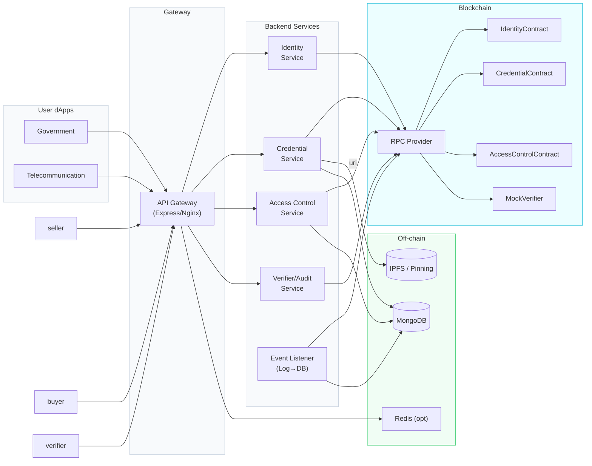

## Backend Network Design (Presentation-Ready)

### High-Level Architecture

### Logical Segmentation (Channels/Lanes Analogy)
- Lane 1 (Identity): Issuer onboarding, role management
- Lane 2 (Credentials): Issue/Revoke verifiable credentials (ERC721)
- Lane 3 (Access): Consent requests and approvals (requestId -> approved)
- Lane 4 (Verify/Audit): Proof verification, audit trail

### Transaction Management
- All client calls traverse API Gateway (auth, rate-limit, CORS)
- Services sign transactions with server signer (env-configured) or forward to wallet when required
- Event Listener tails chain logs and reconciles DB state (idempotent upserts)

### Data & Security
- Metadata stored on IPFS; on-chain only URI + hash
- MongoDB stores minimal off-chain state (consents, credential index, tx hashes)
- ENV-based contract addresses; checksum validated on boot
- Role-gated actions (issuer) enforced on-chain; subject-only approval enforced on-chain and pre-checked client-side

### Deployment View
- Web apps: Vite/React served via CDN/Nginx
- Backend: Node.js (PM2/Docker)
- RPC: Sepolia/Testnet or Mainnet via provider
- DB: Managed MongoDB (Atlas) + optional Redis
- Monitoring: health endpoints + metrics scraped by Prometheus

### Sequence (Approve Access)
1) Requester calls requestAccess(subject, purposeHash) → `AccessRequested(requestId, ...)`
2) Backend stores pending consent
3) Subject signs requestId (EIP-191) and calls approve(requestId, signature)
4) Chain emits AccessApproved; backend updates `approved=true`

### Sequence (Issue Credential)
1) Issuer role granted to backend signer
2) Input: to, uri → backend computes keccak256(uri)
3) issue(to, hash, uri) → `CredentialIssued(tokenId, ...)`
4) Backend stores credential row with tx hash

