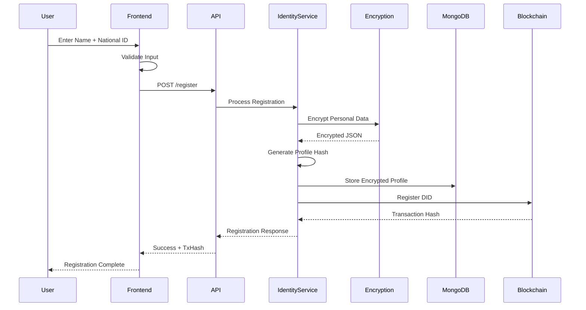
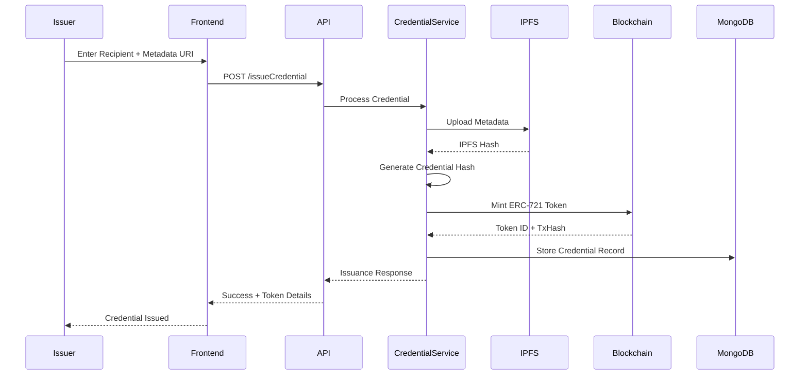
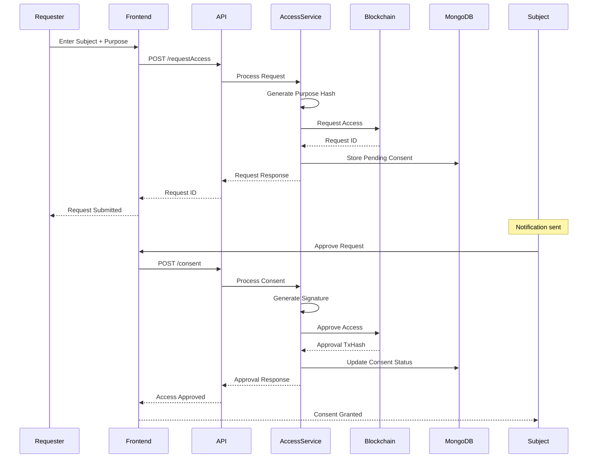

# IdentiChain Data Flow Architecture

## Data Flow Between Components

```mermaid
flowchart LR
    subgraph "User Input Layer"
        UI1[User Registration Data<br/>Name + National ID]
        UI2[Credential Request Data<br/>Recipient + Metadata]
        UI3[Access Request Data<br/>Subject + Purpose]
        UI4[Verification Data<br/>Profile/TX Hash]
    end
    
    subgraph "Frontend Processing"
        FE1[Form Validation]
        FE2[Data Sanitization]
        FE3[Wallet Integration]
        FE4[API Calls]
    end
    
    subgraph "API Gateway"
        API1[Request Routing]
        API2[Authentication]
        API3[Rate Limiting]
        API4[Response Handling]
    end
    
    subgraph "Backend Services"
        BS1[Identity Service<br/>Encryption + Hashing]
        BS2[Credential Service<br/>ERC-721 Processing]
        BS3[Access Control Service<br/>Consent Management]
        BS4[Verification Service<br/>ZK Proof Validation]
    end
    
    subgraph "Data Processing"
        DP1[AES-256-GCM Encryption]
        DP2[Keccak256 Hashing]
        DP3[ECDSA Signature Generation]
        DP4[JSON Serialization]
    end
    
    subgraph "Blockchain Layer"
        BC1[Identity Contract<br/>DID Registration]
        BC2[Credential Contract<br/>Token Minting]
        BC3[Access Control Contract<br/>Consent Approval]
        BC4[Audit Contract<br/>Event Logging]
        BC5[Mock Verifier<br/>Proof Validation]
    end
    
    subgraph "Storage Systems"
        ST1[(MongoDB<br/>Encrypted Profiles)]
        ST2[(IPFS<br/>Metadata Storage)]
        ST3[Redis Cache<br/>Session Data]
    end
    
    %% User Input to Frontend
    UI1 --> FE1
    UI2 --> FE1
    UI3 --> FE1
    UI4 --> FE1
    
    %% Frontend Processing
    FE1 --> FE2
    FE2 --> FE3
    FE3 --> FE4
    
    %% Frontend to API Gateway
    FE4 --> API1
    API1 --> API2
    API2 --> API3
    API3 --> API4
    
    %% API Gateway to Backend Services
    API4 --> BS1
    API4 --> BS2
    API4 --> BS3
    API4 --> BS4
    
    %% Backend Services to Data Processing
    BS1 --> DP1
    BS1 --> DP2
    BS2 --> DP2
    BS3 --> DP3
    BS4 --> DP2
    
    %% Data Processing to Blockchain
    DP1 --> BC1
    DP2 --> BC1
    DP2 --> BC2
    DP3 --> BC3
    DP2 --> BC5
    
    %% Blockchain Events
    BC1 --> BC4
    BC2 --> BC4
    BC3 --> BC4
    
    %% Backend Services to Storage
    BS1 --> ST1
    BS2 --> ST1
    BS3 --> ST1
    BS2 --> ST2
    API4 --> ST3
    
    %% Data Flow Labels
    UI1 -.->|"Personal Data"| FE1
    UI2 -.->|"Credential Data"| FE1
    UI3 -.->|"Access Request"| FE1
    UI4 -.->|"Hash Input"| FE1
    
    FE4 -.->|"HTTP Request"| API1
    API4 -.->|"JSON Response"| FE4
    
    BS1 -.->|"Encrypted Profile"| DP1
    BS1 -.->|"Profile Hash"| DP2
    BS2 -.->|"Credential Hash"| DP2
    BS3 -.->|"Signature"| DP3
    
    DP1 -.->|"Encrypted Data"| ST1
    DP2 -.->|"Hash"| BC1
    DP2 -.->|"Token Hash"| BC2
    DP3 -.->|"Signed Consent"| BC3
    
    %% Styling
    classDef inputLayer fill:#e3f2fd,stroke:#1976d2,stroke-width:2px
    classDef frontendLayer fill:#f3e5f5,stroke:#7b1fa2,stroke-width:2px
    classDef apiLayer fill:#fff3e0,stroke:#f57c00,stroke-width:2px
    classDef serviceLayer fill:#e8f5e8,stroke:#2e7d32,stroke-width:2px
    classDef processingLayer fill:#fce4ec,stroke:#c2185b,stroke-width:2px
    classDef blockchainLayer fill:#fff8e1,stroke:#f57f17,stroke-width:2px
    classDef storageLayer fill:#f1f8e9,stroke:#558b2f,stroke-width:2px
    
    class UI1,UI2,UI3,UI4 inputLayer
    class FE1,FE2,FE3,FE4 frontendLayer
    class API1,API2,API3,API4 apiLayer
    class BS1,BS2,BS3,BS4 serviceLayer
    class DP1,DP2,DP3,DP4 processingLayer
    class BC1,BC2,BC3,BC4,BC5 blockchainLayer
    class ST1,ST2,ST3 storageLayer
```

## Data Flow Scenarios

### 1. User Registration Data Flow

### 2. Credential Issuance Data Flow

### 3. Access Request Data Flow

## Data Security Flow

### Encryption Process
1. **Input Validation**: Sanitize and validate user input
2. **Data Encryption**: Apply AES-256-GCM encryption to sensitive data
3. **Hash Generation**: Create Keccak256 hash for blockchain storage
4. **Signature Creation**: Generate ECDSA signature for consent approval
5. **Secure Storage**: Store encrypted data in MongoDB, hashes on blockchain

### Data Integrity
1. **Hash Verification**: Verify data integrity using stored hashes
2. **Signature Validation**: Validate ECDSA signatures for authenticity
3. **Blockchain Immutability**: Leverage blockchain for tamper-proof records
4. **Audit Trail**: Maintain complete audit trail of all operations

## Performance Optimization

### Caching Strategy
- **Redis Cache**: Store session data and frequently accessed information
- **IPFS Gateway**: Cache metadata and documents for faster access
- **API Response Caching**: Cache API responses for improved performance

### Data Partitioning
- **MongoDB Collections**: Separate collections for different data types
- **IPFS Organization**: Organize metadata by type and access patterns
- **Blockchain Events**: Efficient event filtering and indexing
