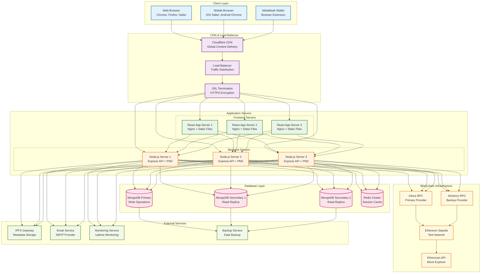
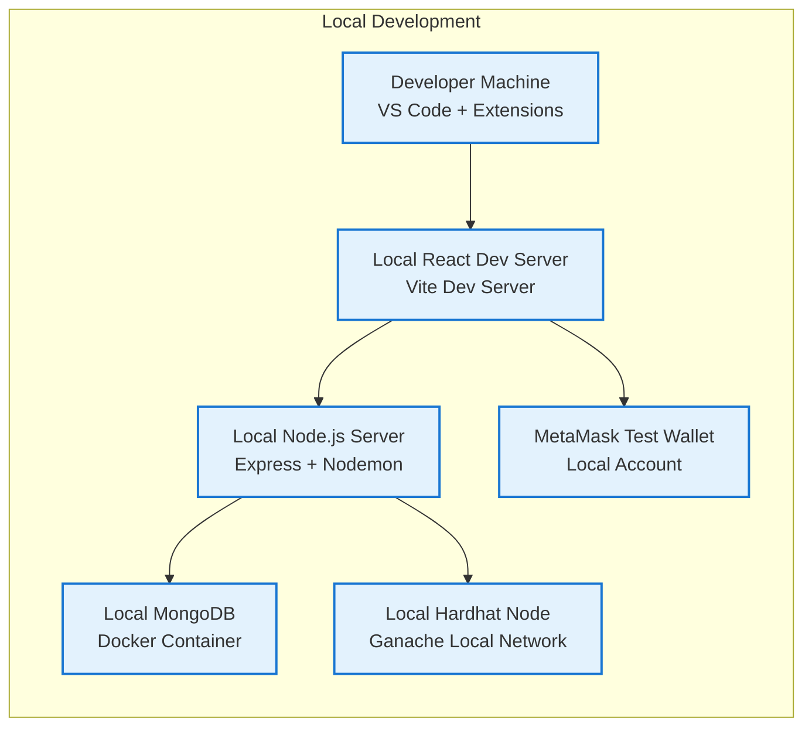
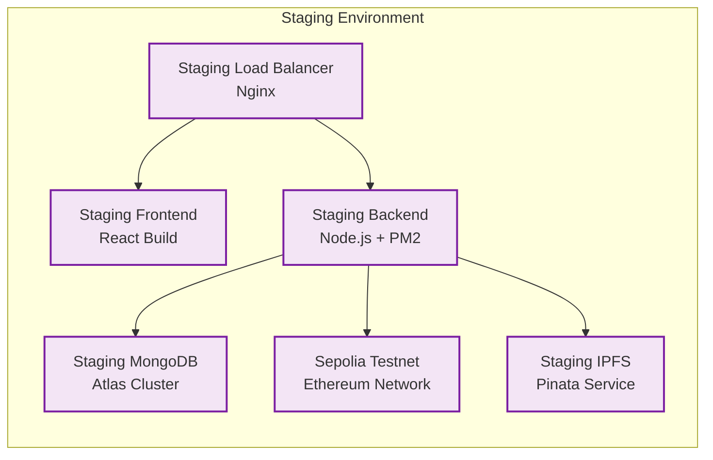
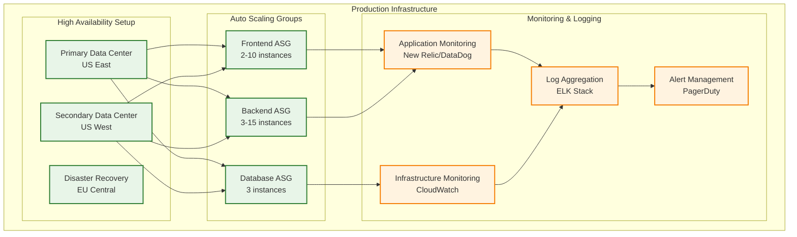
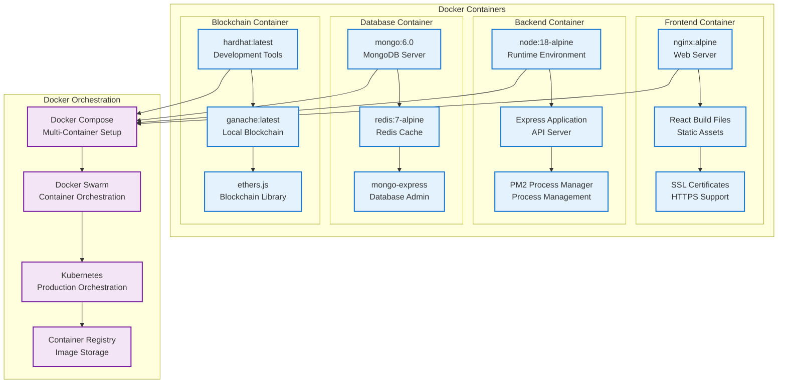
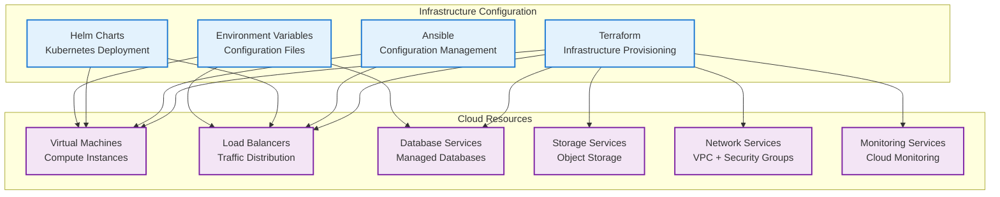
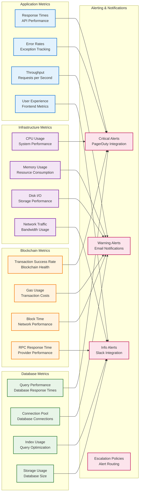

# IdentiChain Deployment Architecture

## Production Deployment Diagram

## Environment-Specific Deployments

### Development Environment

### Staging Environment

### Production Environment

## Containerization Strategy

### Docker Architecture

## Deployment Pipeline

### CI/CD Workflow

```mermaid
flowchart LR
    subgraph "Source Control"
        SC1[Git Repository<br/>GitHub/GitLab]
        SC2[Branch Management<br/>Feature/Release Branches]
        SC3[Pull Requests<br/>Code Review Process]
    end
    
    subgraph "Build Pipeline"
        BP1[Code Quality Check<br/>ESLint + Prettier]
        BP2[Unit Testing<br/>Jest Test Suite]
        BP3[Integration Testing<br/>API Tests]
        BP4[Security Scanning<br/>Vulnerability Check]
        BP5[Build Process<br/>Compilation + Bundling]
    end
    
    subgraph "Deployment Pipeline"
        DP1[Staging Deployment<br/>Automated Staging]
        DP2[Staging Testing<br/>QA Validation]
        DP3[Production Deployment<br/>Blue-Green Deployment]
        DP4[Health Checks<br/>Service Validation]
        DP5[Rollback Capability<br/>Quick Recovery]
    end
    
    SC1 --> SC2
    SC2 --> SC3
    SC3 --> BP1
    
    BP1 --> BP2
    BP2 --> BP3
    BP3 --> BP4
    BP4 --> BP5
    BP5 --> DP1
    
    DP1 --> DP2
    DP2 --> DP3
    DP3 --> DP4
    DP4 --> DP5
    
    %% Styling
    classDef sourceControl fill:#e3f2fd,stroke:#1976d2,stroke-width:2px
    classDef buildPipeline fill:#f3e5f5,stroke:#7b1fa2,stroke-width:2px
    classDef deployPipeline fill:#e8f5e8,stroke:#2e7d32,stroke-width:2px
    
    class SC1,SC2,SC3 sourceControl
    class BP1,BP2,BP3,BP4,BP5 buildPipeline
    class DP1,DP2,DP3,DP4,DP5 deployPipeline
```

## Infrastructure as Code

### Configuration Management

## Monitoring & Observability

### Production Monitoring Stack

