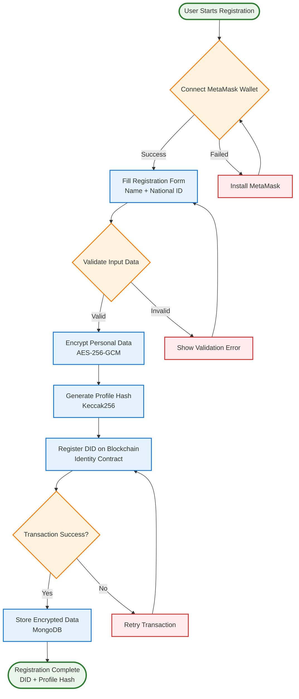
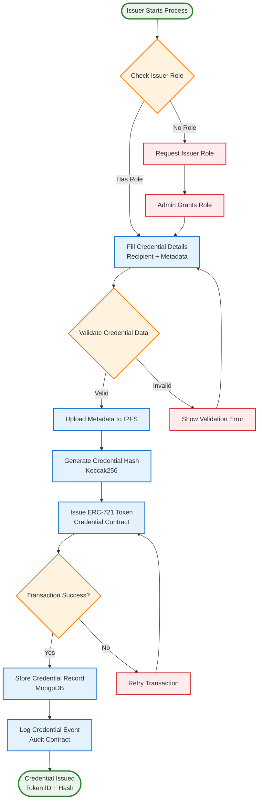
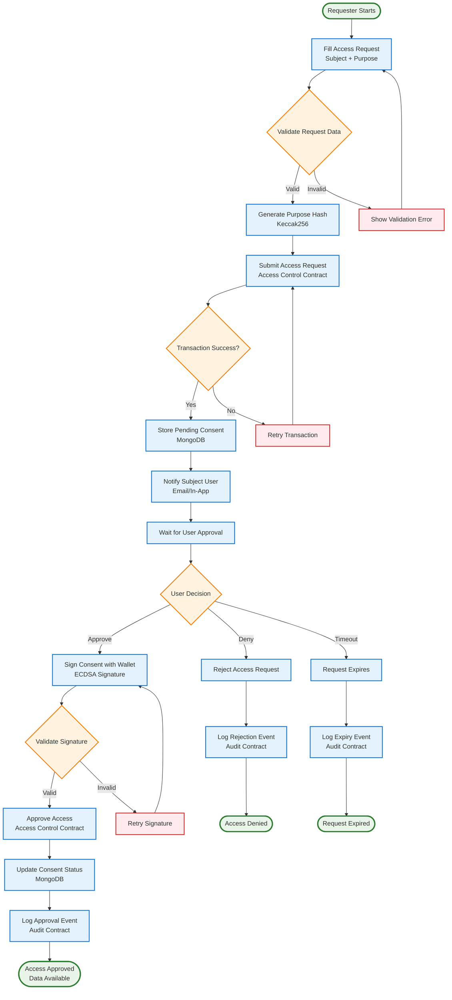
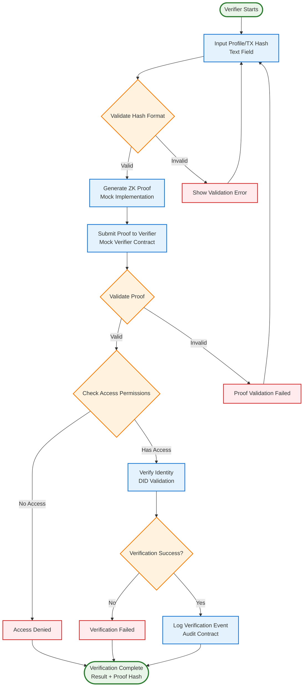
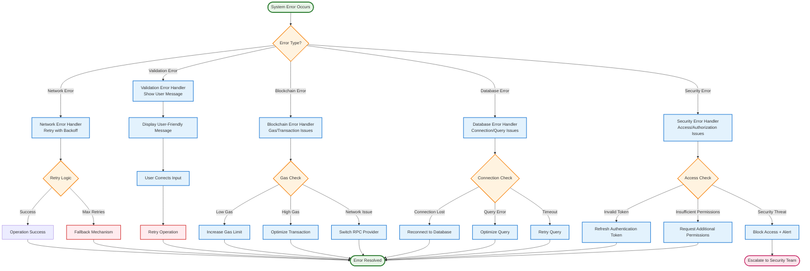
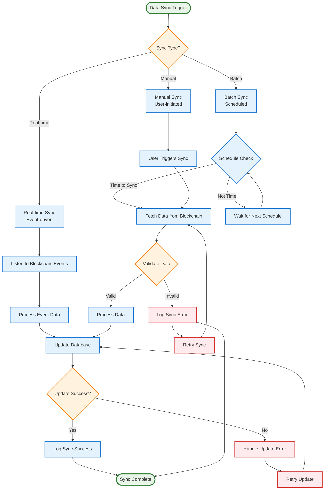

# IdentiChain Flow Diagrams

## User Registration Process Flow

## Credential Issuance Flow

## Access Request & Approval Flow

## Verification Process Flow

## System Error Handling Flow

## Data Synchronization Flow

## Flow Diagram Usage Guidelines

### When to Use Flow Diagrams:

1. **Process Documentation** - Documenting step-by-step processes
2. **User Journey Mapping** - Showing user interactions and decision points
3. **Error Handling** - Illustrating error scenarios and recovery paths
4. **System Workflows** - Showing system-level processes and data flow
5. **Decision Trees** - Mapping decision points and their outcomes
6. **Troubleshooting Guides** - Creating step-by-step problem resolution flows

### Flow Diagram Best Practices:

1. **Clear Start and End Points** - Always show where processes begin and end
2. **Decision Points** - Use diamond shapes for decision points with clear yes/no paths
3. **Process Steps** - Use rectangles for process steps with clear descriptions
4. **Error Handling** - Include error paths and recovery mechanisms
5. **Parallel Processes** - Show concurrent processes where applicable
6. **Swimlanes** - Use swimlanes to separate different actors or systems
7. **Consistent Styling** - Use consistent colors and shapes for similar elements

### Benefits of Flow Diagrams:

- **Process Clarity** - Makes complex processes easy to understand
- **Error Identification** - Helps identify potential failure points
- **User Experience** - Improves user experience by showing clear paths
- **Documentation** - Serves as comprehensive process documentation
- **Training** - Helps train new team members on system processes
- **Optimization** - Identifies opportunities for process improvement
