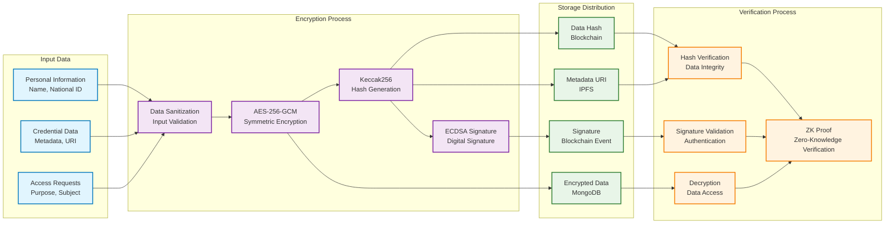
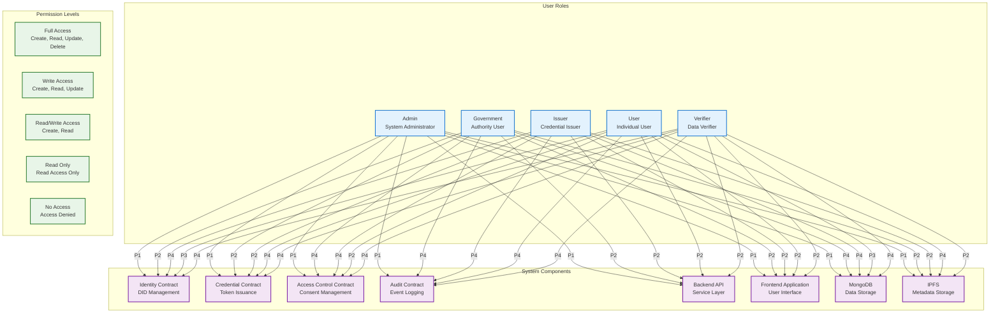

# IdentiChain Security Model

## Multi-Layer Security Architecture

```mermaid
graph TB
    subgraph "Authentication Layer"
        A1[MetaMask Wallet<br/>ECDSA Key Pair]
        A2[Wallet Signature<br/>Message Signing]
        A3[Session Management<br/>JWT Tokens]
    end
    
    subgraph "Authorization Layer"
        Z1[Role-Based Access Control<br/>RBAC Implementation]
        Z2[Smart Contract Roles<br/>Admin, Issuer, Government, User]
        Z3[Permission Matrix<br/>Granular Access Control]
    end
    
    subgraph "Data Protection Layer"
        D1[AES-256-GCM Encryption<br/>Sensitive Data]
        D2[Keccak256 Hashing<br/>Data Integrity]
        D3[ECDSA Signatures<br/>Non-Repudiation]
        D4[IPFS Storage<br/>Decentralized Metadata]
    end
    
    subgraph "Blockchain Security Layer"
        B1[Immutable Records<br/>Tamper-Proof Storage]
        B2[Smart Contract Validation<br/>Business Logic Enforcement]
        B3[Event Logging<br/>Audit Trail]
        B4[Gas Limit Protection<br/>DoS Prevention]
    end
    
    subgraph "Network Security Layer"
        N1[HTTPS/TLS<br/>Transport Encryption]
        N2[CORS Configuration<br/>Cross-Origin Protection]
        N3[Rate Limiting<br/>API Protection]
        N4[Input Validation<br/>Injection Prevention]
    end
    
    subgraph "Infrastructure Security"
        I1[MongoDB Encryption<br/>At-Rest Security]
        I2[Environment Variables<br/>Secret Management]
        I3[API Gateway<br/>Request Filtering]
        I4[Monitoring & Logging<br/>Security Analytics]
    end
    
    %% Security Flow Connections
    A1 --> A2
    A2 --> A3
    A3 --> Z1
    
    Z1 --> Z2
    Z2 --> Z3
    Z3 --> D1
    
    D1 --> D2
    D2 --> D3
    D3 --> D4
    D4 --> B1
    
    B1 --> B2
    B2 --> B3
    B3 --> B4
    B4 --> N1
    
    N1 --> N2
    N2 --> N3
    N3 --> N4
    N4 --> I1
    
    I1 --> I2
    I2 --> I3
    I3 --> I4
    
    %% Styling
    classDef authLayer fill:#e3f2fd,stroke:#1976d2,stroke-width:2px
    classDef authzLayer fill:#f3e5f5,stroke:#7b1fa2,stroke-width:2px
    classDef dataLayer fill:#e8f5e8,stroke:#2e7d32,stroke-width:2px
    classDef blockchainLayer fill:#fff8e1,stroke:#f57f17,stroke-width:2px
    classDef networkLayer fill:#fff3e0,stroke:#f57c00,stroke-width:2px
    classDef infraLayer fill:#fce4ec,stroke:#c2185b,stroke-width:2px
    
    class A1,A2,A3 authLayer
    class Z1,Z2,Z3 authzLayer
    class D1,D2,D3,D4 dataLayer
    class B1,B2,B3,B4 blockchainLayer
    class N1,N2,N3,N4 networkLayer
    class I1,I2,I3,I4 infraLayer
```

## Encryption & Data Protection Flow

## Access Control Matrix

## Threat Model & Mitigation

```mermaid
flowchart TD
    subgraph "Threat Categories"
        T1[Data Breach<br/>Unauthorized Access]
        T2[Identity Theft<br/>Impersonation]
        T3[Man-in-the-Middle<br/>Network Attacks]
        T4[Smart Contract Vulnerabilities<br/>Code Exploitation]
        T5[Social Engineering<br/>User Manipulation]
        T6[Insider Threats<br/>Privileged Access Abuse]
    end
    
    subgraph "Mitigation Strategies"
        M1[End-to-End Encryption<br/>AES-256-GCM]
        M2[Multi-Factor Authentication<br/>Wallet + Biometrics]
        M3[Transport Security<br/>HTTPS/TLS]
        M4[Code Audits<br/>Smart Contract Testing]
        M5[User Education<br/>Security Awareness]
        M6[Access Monitoring<br/>Audit Logging]
    end
    
    subgraph "Security Controls"
        SC1[Input Validation<br/>Sanitization]
        SC2[Rate Limiting<br/>DoS Protection]
        SC3[Signature Verification<br/>ECDSA Validation]
        SC4[Role-Based Access<br/>RBAC Implementation]
        SC5[Audit Trail<br/>Immutable Logging]
        SC6[Key Management<br/>Secure Storage]
    end
    
    %% Threat to Mitigation Mapping
    T1 --> M1
    T1 --> M6
    T1 --> SC3
    T1 --> SC4
    
    T2 --> M2
    T2 --> SC3
    T2 --> SC5
    
    T3 --> M3
    T3 --> SC1
    T3 --> SC2
    
    T4 --> M4
    T4 --> SC4
    T4 --> SC5
    
    T5 --> M5
    T5 --> SC1
    T5 --> SC6
    
    T6 --> M6
    T6 --> SC4
    T6 --> SC5
    T6 --> SC6
    
    %% Styling
    classDef threat fill:#ffebee,stroke:#d32f2f,stroke-width:2px
    classDef mitigation fill:#e8f5e8,stroke:#2e7d32,stroke-width:2px
    classDef control fill:#e3f2fd,stroke:#1976d2,stroke-width:2px
    
    class T1,T2,T3,T4,T5,T6 threat
    class M1,M2,M3,M4,M5,M6 mitigation
    class SC1,SC2,SC3,SC4,SC5,SC6 control
```

## Security Compliance Framework

### Data Protection Standards
- **GDPR Compliance**: User consent management and data portability
- **SOC 2 Type II**: Security, availability, and confidentiality controls
- **ISO 27001**: Information security management system
- **NIST Cybersecurity Framework**: Risk-based security approach

### Audit & Monitoring
- **Real-time Monitoring**: Continuous security event monitoring
- **Incident Response**: Automated threat detection and response
- **Compliance Reporting**: Regular security assessment reports
- **Penetration Testing**: Regular security vulnerability assessments

### Key Security Features
1. **Zero-Knowledge Proofs**: Privacy-preserving verification
2. **Multi-Signature Support**: Enhanced transaction security
3. **Time-Locked Contracts**: Time-based access control
4. **Emergency Pause**: Circuit breaker for critical functions
5. **Upgrade Mechanisms**: Secure contract upgrade patterns
