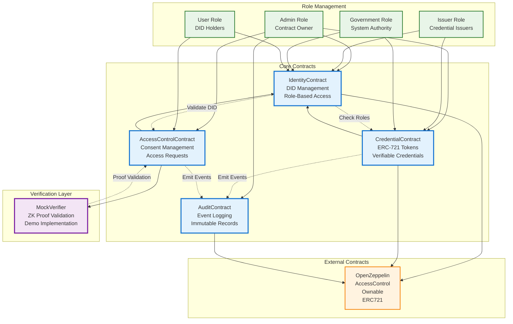
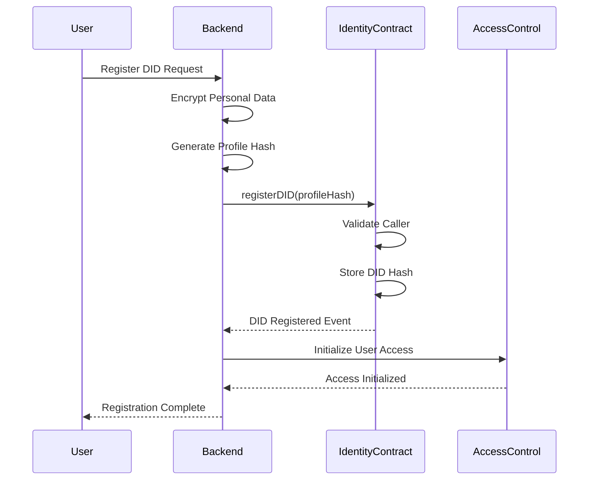
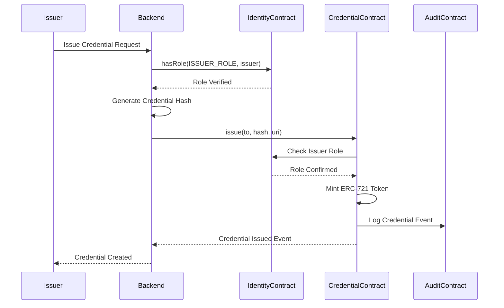
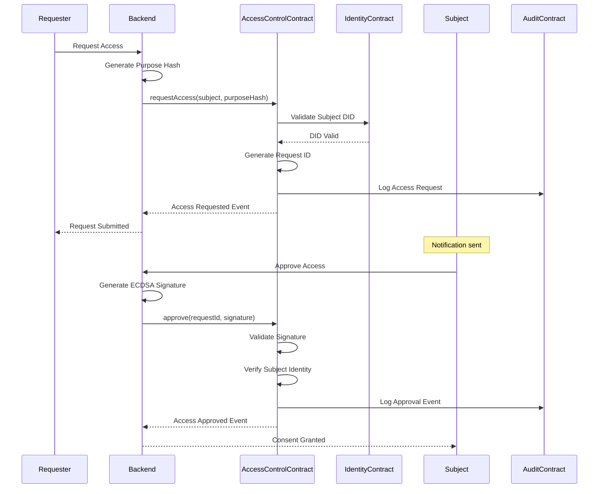
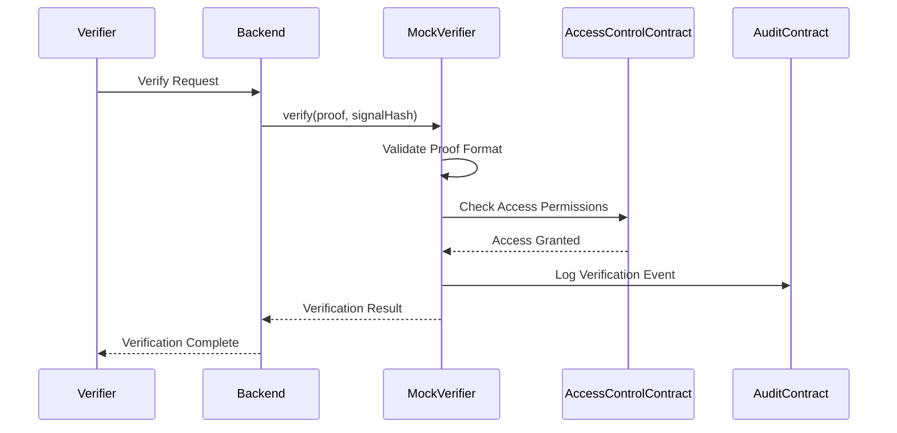
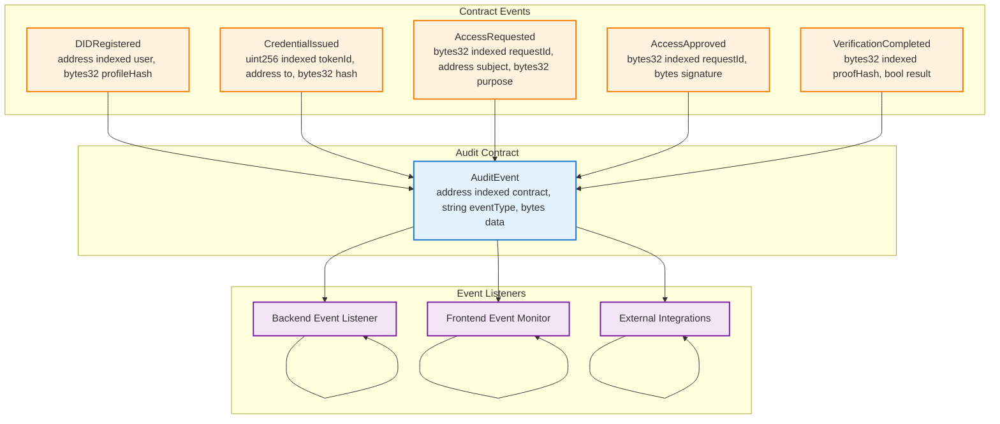

# IdentiChain Smart Contract Interactions

## Smart Contract Architecture & Relationships



## Contract Interaction Flow

### 1. DID Registration Flow



### 2. Credential Issuance Flow



### 3. Access Request & Approval Flow



### 4. Verification Flow



## Contract State Management

### State Variables

```mermaid
graph LR
    subgraph "IdentityContract State"
        DIDHashes[DID Hashes Mapping<br/>address => bytes32]
        Roles[Role Management<br/>ISSUER_ROLE, GOVERNMENT_ROLE]
        Owner[Contract Owner<br/>address]
    end
    
    subgraph "CredentialContract State"
        Tokens[Token Data<br/>tokenId => TokenInfo]
        TokenCounter[Token Counter<br/>uint256]
        IdentityRef[Identity Contract Reference<br/>address]
    end
    
    subgraph "AccessControlContract State"
        Requests[Access Requests<br/>bytes32 => RequestInfo]
        Consents[Consent Records<br/>bytes32 => ConsentInfo]
        VerifierRef[Verifier Contract Reference<br/>address]
    end
    
    subgraph "AuditContract State"
        Events[Event Logs<br/>Event[]]
        EventCounter[Event Counter<br/>uint256]
    end
    
    %% State Relationships
    DIDHashes --> Tokens
    Roles --> Tokens
    Requests --> Consents
    VerifierRef --> Requests
    
    %% Styling
    classDef state fill:#e8f5e8,stroke:#2e7d32,stroke-width:2px
    class DIDHashes,Roles,Owner,Tokens,TokenCounter,IdentityRef,Requests,Consents,VerifierRef,Events,EventCounter state
```

## Event Emission Patterns

### Event Flow Architecture



## Security Considerations

### Access Control Matrix

| Role | Identity Contract | Credential Contract | Access Control | Audit Contract |
|------|------------------|-------------------|----------------|----------------|
| Admin | Full Control | Full Control | Full Control | Full Control |
| Government | Read Access | Issue Credentials | Read Access | Read Access |
| Issuer | Read Access | Issue Credentials | Read Access | Read Access |
| User | Register DID | Own Tokens | Approve Access | Read Own Events |

### Contract Upgradeability
- **Proxy Pattern**: Not implemented (immutable contracts for security)
- **Role Management**: Admin can add/remove roles dynamically
- **Emergency Functions**: Admin can pause critical functions if needed

### Gas Optimization
- **Event Emission**: Efficient event structures for gas savings
- **Storage Optimization**: Packed structs and efficient data types
- **Batch Operations**: Support for batch processing where applicable
