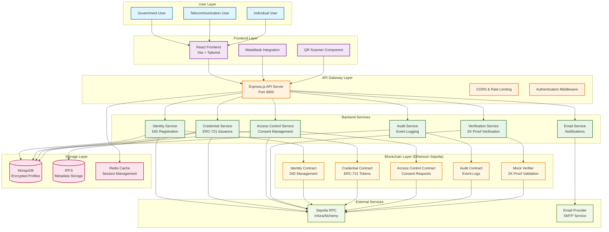

# IdentiChain System Architecture

## High-Level System Architecture

## Component Relationships

### Frontend Components
- **React Application**: Main user interface built with Vite and Tailwind CSS
- **MetaMask Integration**: Handles wallet connections and transaction signing
- **QR Scanner**: Captures QR codes for credential verification

### Backend Services
- **Identity Service**: Manages DID registration and profile encryption
- **Credential Service**: Handles ERC-721 token issuance and metadata
- **Access Control Service**: Manages consent requests and approvals
- **Verification Service**: Processes ZK proof verification
- **Email Service**: Sends notifications and alerts
- **Audit Service**: Logs all system events for compliance

### Smart Contracts
- **Identity Contract**: Core DID management with role-based access
- **Credential Contract**: ERC-721 implementation for verifiable credentials
- **Access Control Contract**: Consent request and approval mechanism
- **Audit Contract**: Immutable event logging
- **Mock Verifier**: Placeholder for ZK proof validation

### Data Storage
- **MongoDB**: Encrypted profile storage with AES-256-GCM
- **IPFS**: Decentralized metadata and document storage
- **Redis**: Session management and caching

## Security Architecture

### Encryption Layers
1. **On-chain**: Only hashes and metadata stored
2. **Off-chain**: Sensitive data encrypted with AES-256-GCM
3. **Transport**: HTTPS/TLS for all API communications
4. **Signatures**: ECDSA signatures for consent approvals

### Access Control
1. **Role-based**: Issuer and Government roles on blockchain
2. **Wallet-based**: User authentication via MetaMask
3. **Consent-based**: Subject-controlled data access
4. **Audit trail**: All actions logged immutably
