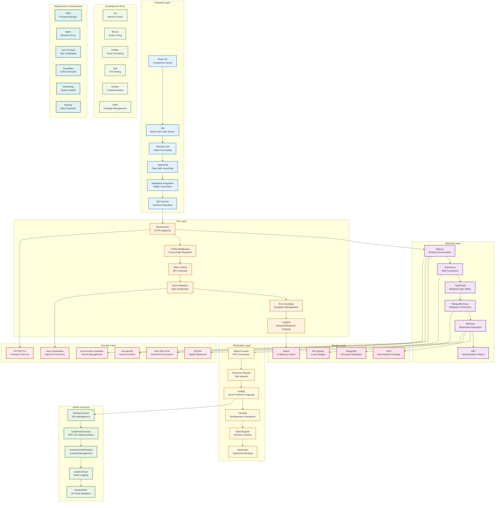
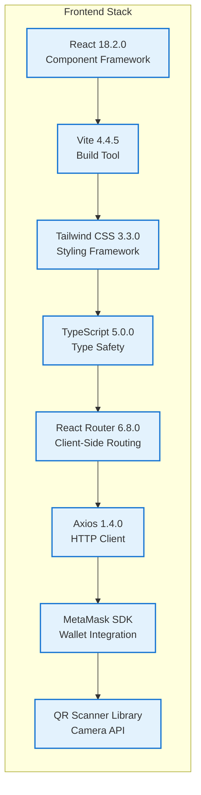
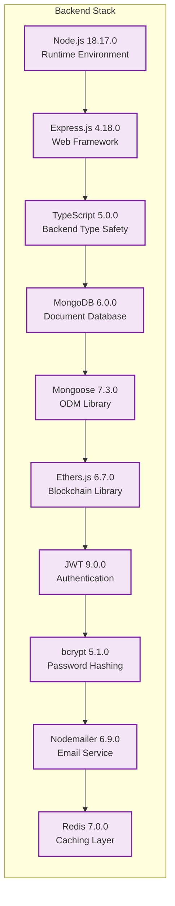
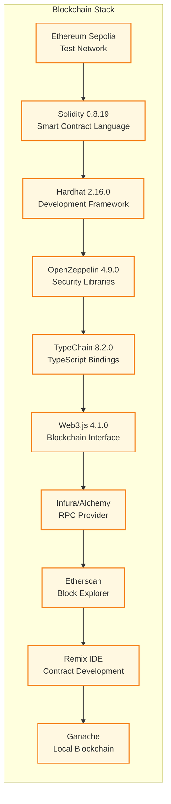

# IdentiChain Technology Stack

## Complete Technology Architecture

## Technology Stack Details

### Frontend Technologies

### Backend Technologies

### Blockchain Technologies

## Development Workflow

### Build & Deployment Pipeline

```mermaid
flowchart LR
    subgraph "Development Phase"
        D1[Local Development<br/>VS Code + Extensions]
        D2[Code Quality<br/>ESLint + Prettier]
        D3[Testing<br/>Jest + Unit Tests]
        D4[Version Control<br/>Git + GitHub]
    end
    
    subgraph "Build Phase"
        B1[Frontend Build<br/>Vite Production Build]
        B2[Backend Build<br/>TypeScript Compilation]
        B3[Contract Compilation<br/>Hardhat Compile]
        B4[Contract Deployment<br/>Sepolia Network]
    end
    
    subgraph "Deployment Phase"
        P1[Containerization<br/>Docker Images]
        P2[Infrastructure<br/>Cloud Hosting]
        P3[Load Balancing<br/>Nginx Configuration]
        P4[SSL/TLS<br/>Let's Encrypt Certificates]
    end
    
    D1 --> D2
    D2 --> D3
    D3 --> D4
    D4 --> B1
    
    B1 --> B2
    B2 --> B3
    B3 --> B4
    B4 --> P1
    
    P1 --> P2
    P2 --> P3
    P3 --> P4
    
    %% Styling
    classDef devPhase fill:#e3f2fd,stroke:#1976d2,stroke-width:2px
    classDef buildPhase fill:#f3e5f5,stroke:#7b1fa2,stroke-width:2px
    classDef deployPhase fill:#e8f5e8,stroke:#2e7d32,stroke-width:2px
    
    class D1,D2,D3,D4 devPhase
    class B1,B2,B3,B4 buildPhase
    class P1,P2,P3,P4 deployPhase
```

## Performance & Scalability

### Optimization Strategies
1. **Frontend Optimization**
   - Code splitting with Vite
   - Lazy loading of components
   - Image optimization
   - Bundle size optimization

2. **Backend Optimization**
   - Connection pooling for MongoDB
   - Redis caching layer
   - API response compression
   - Database query optimization

3. **Blockchain Optimization**
   - Gas-efficient smart contracts
   - Batch transaction processing
   - Event filtering and indexing
   - RPC provider optimization

### Monitoring & Analytics
- **Application Monitoring**: PM2 process monitoring
- **Database Monitoring**: MongoDB performance metrics
- **Blockchain Monitoring**: Transaction success rates
- **User Analytics**: Usage patterns and performance metrics
- **Security Monitoring**: Threat detection and incident response

## Security Considerations

### Technology Security Stack
1. **Transport Security**: HTTPS/TLS 1.3
2. **Data Encryption**: AES-256-GCM
3. **Authentication**: JWT + MetaMask signatures
4. **Input Validation**: Comprehensive sanitization
5. **Dependency Management**: Regular security updates
6. **Environment Security**: Secure secret management

### Compliance & Standards
- **GDPR**: Data protection and privacy compliance
- **SOC 2**: Security and availability controls
- **ISO 27001**: Information security management
- **OWASP**: Web application security standards
