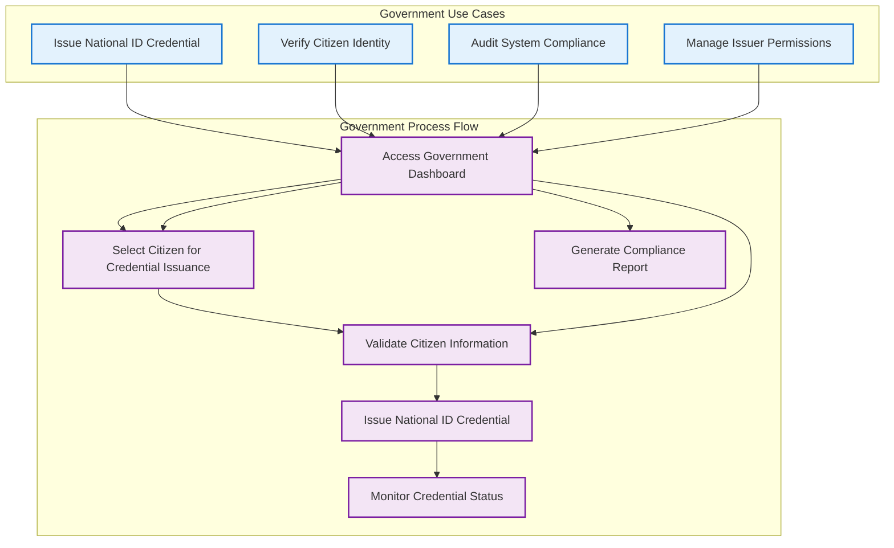
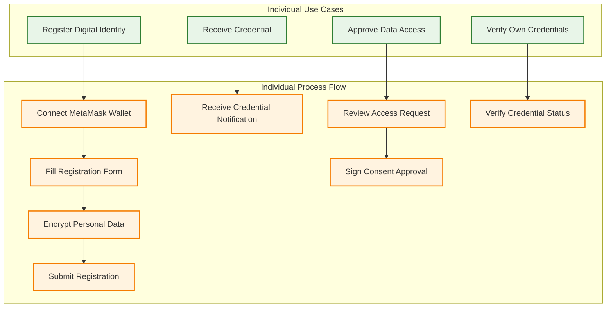
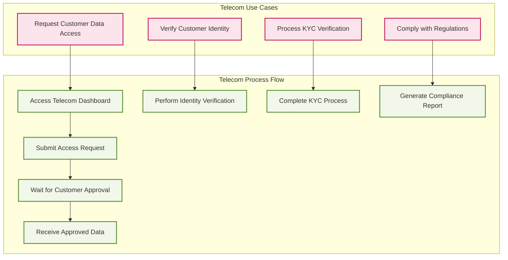

# IdentiChain Use Case Diagram

## System Use Cases & User Interactions

```mermaid
graph TB
    subgraph "Actors"
        A1[Government User<br/>System Authority]
        A2[Telecommunication User<br/>Service Provider]
        A3[Individual User<br/>Citizen/Consumer]
        A4[Issuer<br/>Credential Provider]
        A5[Verifier<br/>Data Validator]
        A6[System Admin<br/>Platform Administrator]
    end
    
    subgraph "Identity Management"
        UC1[Register Digital Identity<br/>Create DID]
        UC2[Update Identity Information<br/>Modify Profile]
        UC3[Revoke Identity<br/>Deactivate DID]
        UC4[Verify Identity<br/>Validate DID]
    end
    
    subgraph "Credential Management"
        UC5[Issue Verifiable Credential<br/>Create ERC-721 Token]
        UC6[Revoke Credential<br/>Invalidate Token]
        UC7[Transfer Credential<br/>Move Ownership]
        UC8[View Credential History<br/>Access Records]
    end
    
    subgraph "Access Control"
        UC9[Request Data Access<br/>Submit Consent Request]
        UC10[Approve Access Request<br/>Grant Consent]
        UC11[Deny Access Request<br/>Reject Consent]
        UC12[Manage Consent Preferences<br/>Update Settings]
    end
    
    subgraph "Verification & Audit"
        UC13[Verify Credential<br/>Validate Proof]
        UC14[Generate ZK Proof<br/>Create Zero-Knowledge Proof]
        UC15[View Audit Trail<br/>Access Logs]
        UC16[Export Compliance Report<br/>Generate Reports]
    end
    
    subgraph "System Administration"
        UC17[Manage User Roles<br/>Assign Permissions]
        UC18[Configure System Settings<br/>Update Parameters]
        UC19[Monitor System Health<br/>Track Performance]
        UC20[Handle Security Incidents<br/>Respond to Threats]
    end
    
    %% Government User Use Cases
    A1 --> UC1
    A1 --> UC4
    A1 --> UC5
    A1 --> UC6
    A1 --> UC13
    A1 --> UC15
    A1 --> UC16
    A1 --> UC17
    
    %% Telecommunication User Use Cases
    A2 --> UC4
    A2 --> UC9
    A2 --> UC13
    A2 --> UC15
    
    %% Individual User Use Cases
    A3 --> UC1
    A3 --> UC2
    A3 --> UC8
    A3 --> UC10
    A3 --> UC11
    A3 --> UC12
    A3 --> UC14
    
    %% Issuer Use Cases
    A4 --> UC5
    A4 --> UC6
    A4 --> UC8
    A4 --> UC15
    
    %% Verifier Use Cases
    A5 --> UC4
    A5 --> UC13
    A5 --> UC15
    
    %% System Admin Use Cases
    A6 --> UC3
    A6 --> UC17
    A6 --> UC18
    A6 --> UC19
    A6 --> UC20
    
    %% Use Case Relationships
    UC1 --> UC5
    UC5 --> UC8
    UC9 --> UC10
    UC9 --> UC11
    UC10 --> UC13
    UC13 --> UC15
    
    %% Styling
    classDef actor fill:#e3f2fd,stroke:#1976d2,stroke-width:2px
    classDef identity fill:#f3e5f5,stroke:#7b1fa2,stroke-width:2px
    classDef credential fill:#e8f5e8,stroke:#2e7d32,stroke-width:2px
    classDef access fill:#fff3e0,stroke:#f57c00,stroke-width:2px
    classDef verification fill:#fce4ec,stroke:#c2185b,stroke-width:2px
    classDef admin fill:#f1f8e9,stroke:#558b2f,stroke-width:2px
    
    class A1,A2,A3,A4,A5,A6 actor
    class UC1,UC2,UC3,UC4 identity
    class UC5,UC6,UC7,UC8 credential
    class UC9,UC10,UC11,UC12 access
    class UC13,UC14,UC15,UC16 verification
    class UC17,UC18,UC19,UC20 admin
```

## Detailed Use Case Scenarios

### 1. Government User Scenarios

### 2. Individual User Scenarios

### 3. Telecommunication User Scenarios

## Use Case Priority Matrix

### High Priority Use Cases
1. **Register Digital Identity** - Core system functionality
2. **Issue Verifiable Credential** - Primary business value
3. **Request Data Access** - Essential for consent management
4. **Approve Access Request** - User control over data
5. **Verify Credential** - System validation capability

### Medium Priority Use Cases
1. **Update Identity Information** - Profile management
2. **Revoke Credential** - Credential lifecycle management
3. **View Audit Trail** - Compliance and transparency
4. **Manage Consent Preferences** - User experience enhancement

### Low Priority Use Cases
1. **Transfer Credential** - Advanced functionality
2. **Generate ZK Proof** - Privacy enhancement
3. **Export Compliance Report** - Administrative feature
4. **Handle Security Incidents** - Emergency response

## User Journey Mapping

### Primary User Journeys
1. **New User Onboarding**: Register → Receive Credential → Manage Access
2. **Credential Verification**: Submit Proof → Validate → Receive Result
3. **Data Access Request**: Request → Wait for Approval → Access Data
4. **System Administration**: Monitor → Configure → Maintain

### Success Metrics
- **User Registration Rate**: Percentage of successful identity registrations
- **Credential Issuance Rate**: Number of credentials issued per day
- **Access Request Approval Rate**: Percentage of approved access requests
- **System Uptime**: Availability percentage of the platform
- **User Satisfaction**: Feedback scores from user interactions
