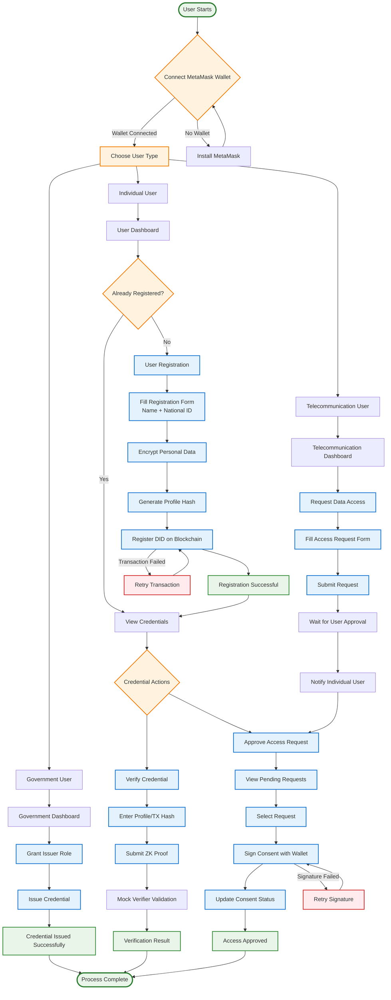

# IdentiChain User Journey Flow

## Complete User Journey Process

## User Journey Breakdown

### 1. Government User Journey
1. **Connect Wallet**: Link MetaMask wallet to application
2. **Access Dashboard**: Enter government-specific dashboard
3. **Grant Issuer Role**: Assign issuer permissions to addresses
4. **Issue Credentials**: Create and issue verifiable credentials
5. **Monitor System**: Track issued credentials and access requests

### 2. Telecommunication User Journey
1. **Connect Wallet**: Link MetaMask wallet to application
2. **Access Dashboard**: Enter telecommunication-specific dashboard
3. **Request Access**: Submit data access requests to individuals
4. **Provide Purpose**: Specify why access is needed
5. **Wait for Approval**: Monitor request status until approved
6. **Access Data**: Retrieve approved data for verification

### 3. Individual User Journey
1. **Connect Wallet**: Link MetaMask wallet to application
2. **Registration**: Create digital identity with encrypted personal data
3. **Receive Credentials**: Accept verifiable credentials from issuers
4. **Manage Access**: Approve or deny data access requests
5. **Verify Credentials**: Use verification tools to prove identity

## Key Decision Points

### Wallet Connection
- **Success**: User proceeds to role selection
- **Failure**: Guided to install MetaMask wallet

### Registration Status
- **New User**: Guided through registration process
- **Existing User**: Direct access to credential management

### Credential Actions
- **Verify**: Submit credentials for validation
- **Approve**: Grant access to requesting parties

## Error Handling

### Transaction Failures
- Automatic retry mechanism for blockchain transactions
- Clear error messages with suggested solutions
- Fallback options for network issues

### Signature Failures
- Retry mechanism for wallet signing
- Alternative signing methods if available
- Clear instructions for manual signing

## Success Indicators

### Registration Success
- ✅ Transaction hash recorded
- ✅ Profile hash generated
- ✅ DID registered on blockchain

### Verification Success
- ✅ ZK proof validated
- ✅ Credential status confirmed
- ✅ Verification result displayed

### Access Approval Success
- ✅ Consent signature recorded
- ✅ Access request approved
- ✅ Audit trail updated
