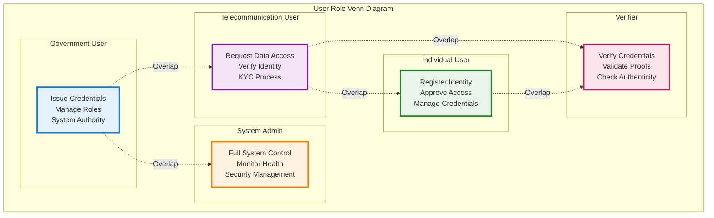
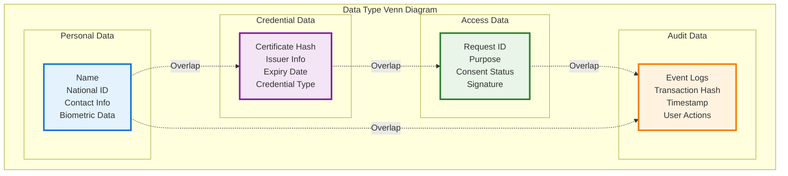
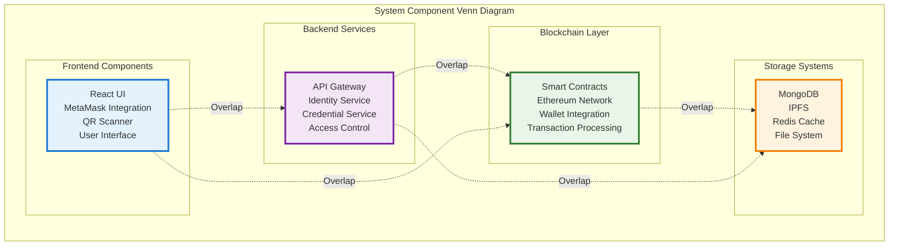
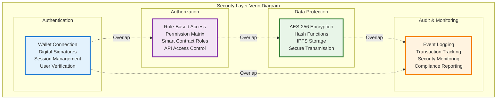
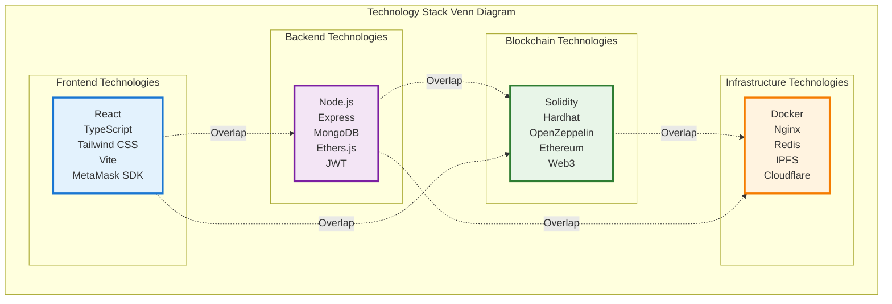
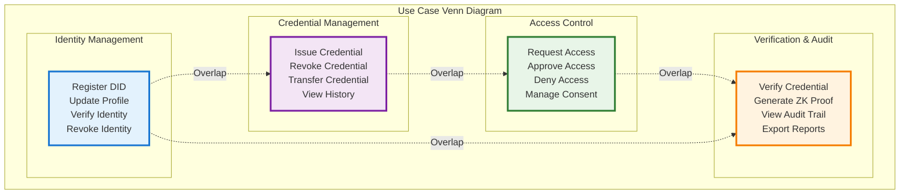
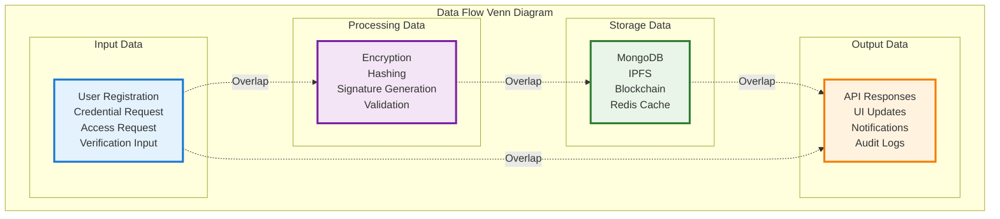

# IdentiChain Venn Diagrams

## User Role Overlaps

## Data Type Relationships

## System Component Overlaps

## Security Layer Overlaps

## Technology Stack Overlaps

## Use Case Overlaps

## Data Flow Overlaps

## Venn Diagram Usage

### When to Use Each Venn Diagram:

1. **User Role Overlaps** - Understanding permission boundaries and shared responsibilities
2. **Data Type Relationships** - Identifying data dependencies and overlaps
3. **System Component Overlaps** - Understanding system integration points
4. **Security Layer Overlaps** - Identifying security coverage and gaps
5. **Technology Stack Overlaps** - Understanding technology dependencies
6. **Use Case Overlaps** - Identifying feature relationships and dependencies
7. **Data Flow Overlaps** - Understanding data transformation and flow patterns

### Benefits of Venn Diagrams:

- **Clear Overlap Visualization** - Shows where different concepts intersect
- **Relationship Identification** - Helps identify dependencies and connections
- **Gap Analysis** - Reveals areas that need attention or development
- **Stakeholder Communication** - Easy to understand for non-technical audiences
- **Decision Making** - Helps prioritize features and development efforts
